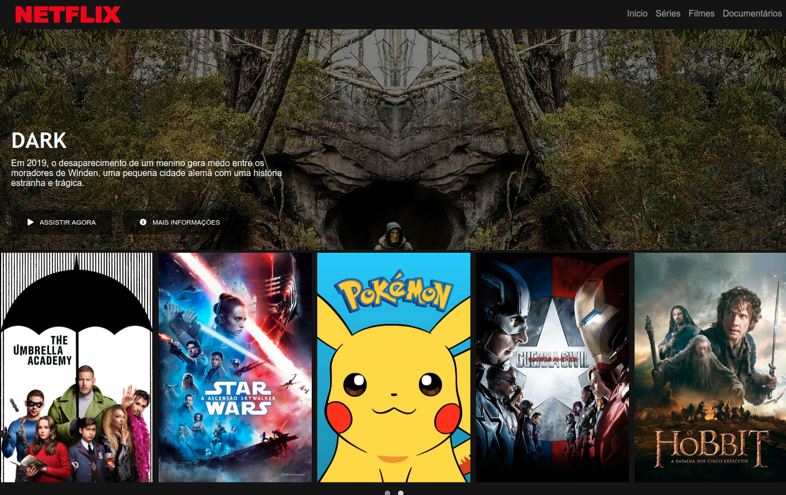

<div align="center">
      
  <h1>HTML | CSS Flexbox | Javascript</h1>

 :rocket: *Netflix clone page: this project will cover the concept of CSS Flexbox and responsiveness*
  </div>

# :pushpin: Table of contents

- [Technologies](#computer-technologies)
- [How to run](#construction_worker-how-to-run)
- [License](#closed_book-license)

# :computer: Technologies

This project was made using the following technologies:

<ul>
  <li><a href="https://www.w3schools.com/html/">HTML</a></li>
  <li><a href="https://developer.mozilla.org/pt-BR/docs/Web/CSS">CSS</a></li>
  <li><a href="https://developer.mozilla.org/pt-BR/docs/Web/JavaScript">Javascript</a></li>
</ul>

# :construction_worker: How to run

### :computer: Downloading project 

```bash
# Clone repository into your machine
$ git clone https://gitlab.com/fbduartesc/netflix-clone.git
```

### 💻 Running project on a web browser

```bash
# Open the file index.html in your browser
$ index.html
```

# :closed_book: License

Released in 2020.

Made with passion by [Fabio Duarte de Souza](https://gitlab.com/fbduartesc) 🚀.
This project is under the [MIT license](https://gitlab.com/fbduartesc/netflix-clone/blob/master/LICENSE).